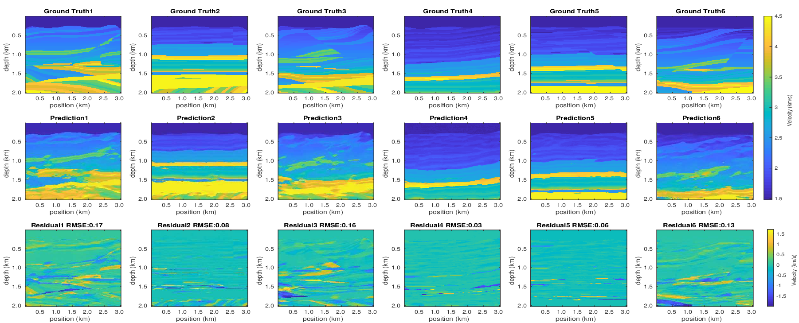

# A Deep-Learning inversion method for seismic velocity model building

Authors: [Jonas Mendonça](https://scholar.google.com.br/citations?user=B7BG9T0AAAAJ&hl=pt-BR&oi=ao), [Keith Roberts](https://scholar.google.com.br/citations?hl=pt-BR&user=iCwepKUAAAAJ), [Jaime Freire](https://bv.fapesp.br/pt/pesquisador/704667/jaime-freire-de-souza/) , [Henrique Bueno](https://scholar.google.com.br/citations?user=eW3gl48AAAAJ&hl=pt-BR), [Hermes Senger](https://scholar.google.com.br/citations?user=vzHhJRoAAAAJ&hl=pt-BR&oi=ao), [Rafael Gioria](https://scholar.google.com.br/citations?hl=pt-BR&user=9Y0xuFoAAAAJ), [Edson Gomi](https://scholar.google.com.br/citations?hl=pt-BR&user=EIatdeAAAAAJ)

# Abstract

The use of Deep Learning in the context of oil exploration represents a new direction for velocity model building techniques. In this work, we present a neural network termed U-net that can be applied to build seismic velocity models. Here we demonstrate that using only four seismograms, we can train a network that can produce accurate predictions of seismic velocity models on an independent dataset. One obstacle to using neural networks for velocity model building is the lack of sufficient data to train the networks. Thus, we also present a methodology to build pseudo-realistic velocity models. We construct a dataset of 2,000 seismic velocity models with sophisticated marine geological features, and we train and test our network with this dataset. Our results show that the neural network can accurately predict domains with multiple horizontal layers, but it struggles with more complex geological features such as faults.

# Process of shots generation
To generate the shots we used the software Devito [https://www.devitoproject.org/] 

# U-net implemented with Keras and Tensorflow

This project has a convolutional neural network, more specifically a U-net implemented with the aid of the Tensorflow / Keras framework. This network aims to predict the speed models present in the subsurface, having as input to the network a set of 4 equidistant seismograms.

We design this network based on the famous [U-Net architecture](https://link.springer.com/chapter/10.1007/978-3-319-24574-4_28). The model architecture consists of two parts:

- Contracting path
- Expansive path 	

# Network Structure 
  

# Obtained Results

After running the experiments, we were able to obtain good prediction results. Below, we present 6 examples of predictions. For these examples we use 20 Hz of frequency.

# Acknowledgements

The author would like to acknolwedge the developers of the [Devito](https://www.opesci.org/devito/). 

If you have any questions about this paper, feel free to contract us: jonas.mendonca@usp.br 
