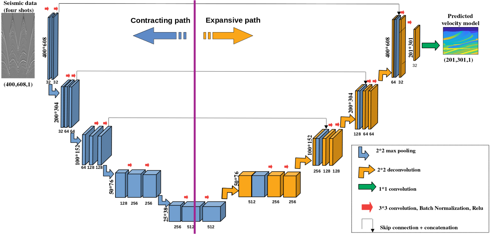

# A Deep-Learning inversion method for seismic velocity model building

Authors: [Jonas Mendonça](https://scholar.google.com.br/citations?user=B7BG9T0AAAAJ&hl=pt-BR&oi=ao), [Keith Roberts](https://scholar.google.com.br/citations?hl=pt-BR&user=iCwepKUAAAAJ), [Jaime Freire](https://bv.fapesp.br/pt/pesquisador/704667/jaime-freire-de-souza/) , [Henrique Bueno](https://scholar.google.com.br/citations?user=eW3gl48AAAAJ&hl=pt-BR), [Hermes Senger](https://scholar.google.com.br/citations?user=vzHhJRoAAAAJ&hl=pt-BR&oi=ao), [Rafael Gioria](https://scholar.google.com.br/citations?hl=pt-BR&user=9Y0xuFoAAAAJ), [Edson Gomi](https://scholar.google.com.br/citations?hl=pt-BR&user=EIatdeAAAAAJ)

# Abstract

The use of Deep Learning in the context of oil exploration represents a new direction for velocity model building techniques. In this work, we present a neural network termed U-net that can be applied to build seismic velocity models. Here we demonstrate that using only four seismograms, we can train a network that can produce accurate predictions of seismic velocity models on an independent dataset. One obstacle to using neural networks for velocity model building is the lack of sufficient data to train the networks. Thus, we also present a methodology to build pseudo-realistic velocity models. We construct a dataset of 2,000 seismic velocity models with sophisticated marine geological features, and we train and test our network with this dataset. Our results show that the neural network can accurately predict domains with multiple horizontal layers, but it struggles with more complex geological features such as faults.


# Network Structure 
  


# Training and Testing

Before training your network, please check the parameters present in the file func/ParamConfig.py. This file contains all the parameters necessary for running the network, including the transfer learning.

```
    #####       FOLDERS OF DATASETS    ######
    self.train_data_dir = '~/Desktop/experiments/'
    self.folder_dataset = ['georec/','vmodel/']

    #####       PARAMETERS OF MODELS   ######
    self.dataDim        = [2000,304]    # Dimension of original one-shot seismic data
    self.newDim         = [400,304]
    self.nclasses       = 1             # Number of output channels
    self.inChannels     = 4             # Number of input channels, number of shots
    self.data_dsp_blk   = (5,1)         # Downsampling ratio of input
    self.modelDim       = [201,301]     # Dimension of one velocity model
    self.modelDimSaida  = [202,302]     # Dimension of output of the network
    self.label_dsp_blk  = (1,1)         # Downsampling ratio of output
    self.dh             = 10            # Space interval 
    self.positions_source =  [0,10,19,28] # Positions of sources

    ####################################################
    ####             NETWORK PARAMETERS             ####
    ####################################################

    self.useTransferLearning=False	  # Parameter of Transfer Learning
    self.epochs        = 10               # Number of epoch
    self.trainSize     = 10               # Number of training set
    self.testSize      = 10               # Number of testing set
    self.modelInicial   = 1               # Initial model of training    
    self.testBatchSize = 5                # Number of batch testing
    self.start_test    = self.trainSize+1 # Position of start Test, you can change manually
    self.batchSize     = 5                # Number of batch size
    self.learnRate     = 1e-3             # Learning rate

```

After that, we can run the training/test by running the following command

```
python3 train.py
python3 test.py
```

# Requirements
```
numpy>=1.11
python=3.7.3
scipy
matplotlib
scikit-learn
scikit-image
tensorflow=2.1.0
tensorflow-gpu=2.1.0
```


# Acknowledgements


If you have any questions about this paper, feel free to contract us: jonas.mendonca@usp.br 
